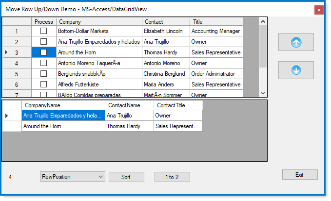
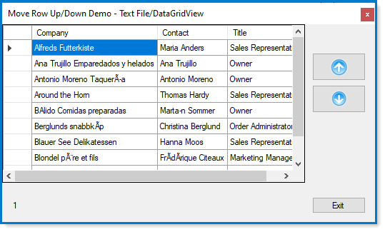
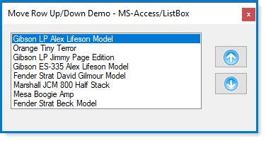

### VB.NET Move rows up/down for DataGridView and ListBox

 

:heavy_check_mark: `DataAccess project` read/write data to backend database or text file.

:heavy_check_mark: `MyControls project` command buttons to use as up/down buttons.

:heavy_check_mark: `UpDownExtensionMethods` language extensions used in MoveDataRow_UpDown project. 

---

---

---

